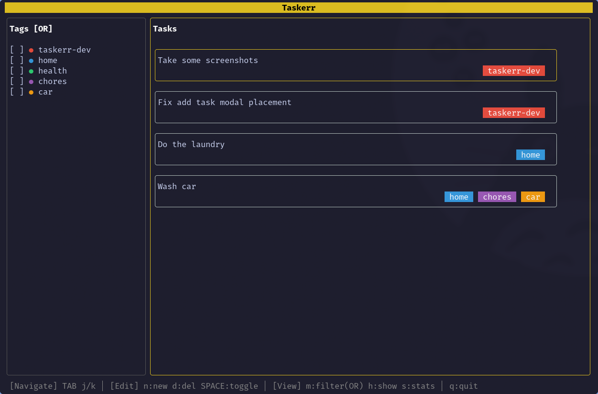
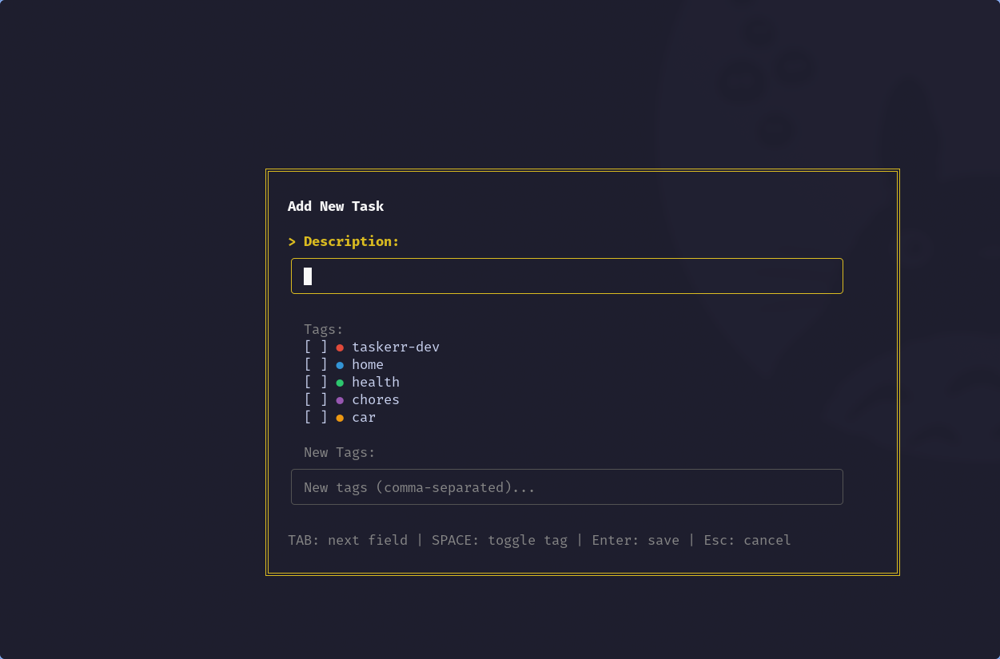
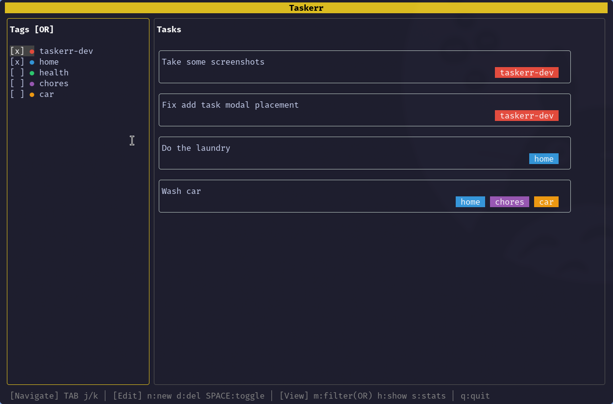
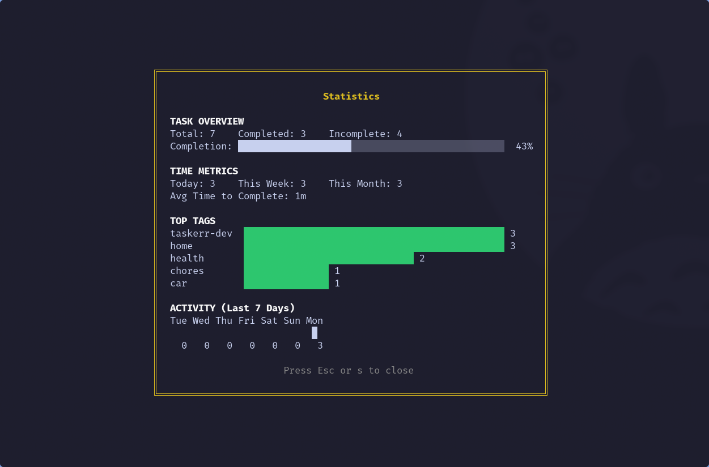

# Taskerr

Taskerr is a task management application written in Go. It provides both a Command Line Interface (CLI) and a Text User Interface (TUI) for managing tasks with tag-based organization and filtering.

## Features

- **CLI & TUI**: Manage tasks from the command line or an interactive terminal interface
- **Tags**: Organize tasks with colored tags
- **Filtering**: Filter tasks by tags (OR/AND modes), hide/show completed tasks
- **Auto-refresh**: TUI automatically updates when database changes externally
- **Database Support**: Works with SQLite, MySQL, and PostgreSQL
- **Configurable**: Supports configuration through a YAML file and environment variables

## TUI

The TUI provides a two-panel interface with tags on the left and tasks on the right.

### Screenshots









### Keyboard Shortcuts

| Group | Key | Action |
|-------|-----|--------|
| **Navigate** | `TAB` | Switch between panels |
| | `j` / `k` | Move down / up |
| **Edit** | `n` | Add new task |
| | `d` | Delete selected item |
| | `SPACE` | Toggle task completion / tag selection |
| **View** | `m` | Toggle filter mode (OR/AND) |
| | `h` | Toggle hide/show completed tasks |
| **Exit** | `q` | Quit |

## CLI Usage

### Task Commands

```bash
# Add a task
taskerr add "Buy groceries"

# Add a task with tags
taskerr add "Finish report" --tags=work,urgent

# List all tasks
taskerr ls
```

### Tag Commands

```bash
# Create a tag
taskerr tag create work

# List all tags
taskerr tag list

# Delete a tag
taskerr tag delete work

# Attach a tag to a task
taskerr task tag <task_id> <tag_name>

# Remove a tag from a task
taskerr task untag <task_id> <tag_name>
```

## Installation

1. Clone the repository:

   ```bash
   git clone https://github.com/mustafmst/taskerr.git
   cd taskerr
   ```

2. Install dependencies:

   ```bash
   go mod tidy
   ```

3. Build the application:
   ```bash
   make build
   ```

## Usage

- **TUI Mode** (default):
  ```bash
  ./build/taskerr
  ```

- **CLI Mode**:
  ```bash
  ./build/taskerr <command> [arguments]
  ```

### Build Commands

```bash
make build    # Build the application
make clean    # Clean build artifacts
make rebuild  # Rebuild the application
```

## Configuration

The application reads configuration from:

1. A YAML file located at `~/.taskerr`
2. Environment variables prefixed with `TASKERR_`

### Environment Variables

```bash
export TASKERR_DB_PROVIDER=sqlite
export TASKERR_DB_CONNECTION=/path/to/database.db
```

## Project Structure

- `internal/config`: Application configuration
- `internal/data`: Database connections and repositories (tasks, tags)
- `internal/cli`: CLI commands
- `internal/tui`: TUI components (panels, modals, styles)
- `main.go`: Entry point

## Dependencies

- Go 1.25.1 or higher
- [Cobra](https://github.com/spf13/cobra) for CLI
- [Bubbletea](https://github.com/charmbracelet/bubbletea) and [Lipgloss](https://github.com/charmbracelet/lipgloss) for TUI
- [Koanf](https://github.com/knadh/koanf) for configuration management
- [GORM](https://gorm.io/) for database handling

## License

MIT License

Copyright (c) 2024

Permission is hereby granted, free of charge, to any person obtaining a copy
of this software and associated documentation files (the "Software"), to deal
in the Software without restriction, including without limitation the rights
to use, copy, modify, merge, publish, distribute, sublicense, and/or sell
copies of the Software, and to permit persons to whom the Software is
furnished to do so, subject to the following conditions:

The above copyright notice and this permission notice shall be included in all
copies or substantial portions of the Software.

THE SOFTWARE IS PROVIDED "AS IS", WITHOUT WARRANTY OF ANY KIND, EXPRESS OR
IMPLIED, INCLUDING BUT NOT LIMITED TO THE WARRANTIES OF MERCHANTABILITY,
FITNESS FOR A PARTICULAR PURPOSE AND NONINFRINGEMENT. IN NO EVENT SHALL THE
AUTHORS OR COPYRIGHT HOLDERS BE LIABLE FOR ANY CLAIM, DAMAGES OR OTHER
LIABILITY, WHETHER IN AN ACTION OF CONTRACT, TORT OR OTHERWISE, ARISING FROM,
OUT OF OR IN CONNECTION WITH THE SOFTWARE OR THE USE OR OTHER DEALINGS IN THE
SOFTWARE.
